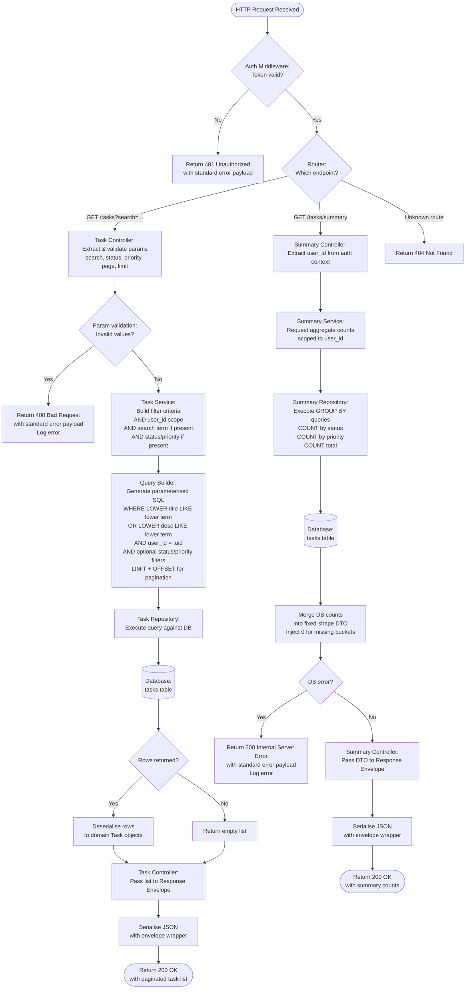

# Architecture — Task Management API: Search & Summary

## Overview
This document describes the architecture for adding keyword search and task summary capabilities to an existing Task Management REST API. The search feature extends `GET /tasks` with a case-insensitive substring filter across `title` and `description`, while the new `GET /tasks/summary` endpoint returns aggregate counts by status and priority. Both endpoints are scoped to the authenticated user and conform to existing API conventions.

## Component Diagram

```mermaid
graph LR
    Client["Client\n(API Consumer)"]
    AuthMW["Auth Middleware\n(Existing)"]
    Router["API Router\n(Existing + Extended)"]
    TaskCtrl["Task Controller\n(Existing + Extended)"]
    SummaryCtrl["Summary Controller\n(New)"]
    TaskSvc["Task Service\n(Existing + Extended)"]
    SummarySvc["Summary Service\n(New)"]
    QueryBuilder["Query Builder\n(Existing + Extended)"]
    TaskRepo["Task Repository\n(Existing + Extended)"]
    SummaryRepo["Summary Repository\n(New)"]
    ErrorHandler["Error Handler\n(Existing)"]
    Logger["Logger\n(Existing)"]
    DB[("Database\nPostgreSQL / MySQL")]
    ResponseEnv["Response Envelope\nSerializer (Existing)"]

    Client -->|"HTTP Request"| AuthMW
    AuthMW -->|"401 if unauth"| Client
    AuthMW -->|"Authenticated req + user_id"| Router
    Router -->|"GET /tasks?search="| TaskCtrl
    Router -->|"GET /tasks/summary"| SummaryCtrl
    Router -->|"400/404/5xx"| ErrorHandler
    TaskCtrl -->|"search + filter params"| TaskSvc
    SummaryCtrl -->|"user_id"| SummarySvc
    TaskSvc -->|"build predicate"| QueryBuilder
    QueryBuilder -->|"parameterised SQL"| TaskRepo
    SummarySvc -->|"aggregate query"| SummaryRepo
    TaskRepo -->|"SQL ILIKE / LOWER()"| DB
    SummaryRepo -->|"GROUP BY SQL"| DB
    DB -->|"rows"| TaskRepo
    DB -->|"count rows"| SummaryRepo
    TaskRepo -->|"domain objects"| TaskSvc
    SummaryRepo -->|"bucket counts"| SummarySvc
    TaskSvc -->|"filtered task list"| TaskCtrl
    SummarySvc -->|"summary DTO"| SummaryCtrl
    TaskCtrl -->|"wrap response"| ResponseEnv
    SummaryCtrl -->|"wrap response"| ResponseEnv
    ErrorHandler -->|"standard error payload"| ResponseEnv
    ResponseEnv -->|"JSON response"| Client
    ErrorHandler -->|"log error"| Logger
    TaskCtrl -->|"log error"| Logger
    SummaryCtrl -->|"log error"| Logger
```

## Data Flow

## Components

| Component | Responsibility | Technology |
|---|---|---|
| Auth Middleware | Validates authentication token on every request; extracts and injects `user_id` into request context; rejects with 401 if invalid or absent | Existing framework middleware (e.g., JWT / session) |
| API Router | Routes `GET /tasks` (extended) and new `GET /tasks/summary` under the existing version namespace; delegates to appropriate controller | Existing HTTP router |
| Task Controller | Receives and validates `search`, `status`, `priority`, and pagination query parameters; returns 400 on invalid input; delegates to Task Service; wraps response | Existing controller, extended |
| Summary Controller | Reads `user_id` from auth context; delegates to Summary Service; wraps response; logs errors | New controller, following existing patterns |
| Task Service | Orchestrates task retrieval business logic; composes filter criteria combining user scope, search term, status, priority, and pagination | Existing service, extended |
| Summary Service | Orchestrates summary aggregation; merges DB counts into a consistently shaped DTO; ensures all zero-value buckets are present | New service |
| Query Builder | Constructs parameterised SQL predicates for the search filter (`LOWER() LIKE` / `ILIKE`); prevents SQL injection; applies all AND-combined filters | Existing query builder, extended |
| Task Repository | Executes filtered list queries against the database; maps rows to domain objects | Existing repository, extended |
| Summary Repository | Executes `GROUP BY` aggregate queries for status and priority counts scoped to a user; returns raw bucket maps | New repository |
| Response Envelope Serializer | Wraps all successful and error payloads in the standard JSON envelope; enforces consistent field naming and HTTP status codes | Existing serializer |
| Error Handler | Catches unhandled errors; formats standard error payloads; delegates to Logger | Existing handler |
| Logger | Records errors and diagnostics consistently across all endpoints for operational monitoring | Existing logging library |
| Database | Persists all task records; executes search and aggregation queries; candidate for `title`/`description` index additions | PostgreSQL or MySQL |

## Design Decisions

| ID | Decision | Rationale |
|---|---|---|
| DD-01 | Extend `GET /tasks` with a `search` query parameter rather than introducing a separate `GET /tasks/search` endpoint | Keeps the API surface minimal, allows natural composition with existing filters (`status`, `priority`, pagination) via logical AND, and avoids endpoint proliferation |
| DD-02 | Implement search using `LOWER(column) LIKE LOWER(:term)` or dialect-native `ILIKE` rather than a full-text search engine | Requirements are scoped to case-insensitive substring matching only; introducing a search engine (Elasticsearch, etc.) would be over-engineered for this scope and adds operational burden |
| DD-03 | `GET /tasks/summary` always returns all status and priority buckets including zeros | FR-06 and NFR-03 mandate a consistent response shape; clients should not need to handle missing keys, which reduces client-side defensive code |
| DD-04 | `GET /tasks/summary` is intentionally unfiltered (reflects all accessible tasks for the user) | Clarifying Q&A defaulted to this behaviour; filtered summaries are explicitly out of scope, avoiding premature complexity |
| DD-05 | Implement summary aggregation using SQL `GROUP BY` in a dedicated Summary Repository rather than loading all tasks into memory and counting in application code | Delegating aggregation to the database is more efficient and scalable; avoids O(n) memory usage as task counts grow |
| DD-06 | Scope both endpoints strictly to the authenticated user's tasks via `user_id` injected by Auth Middleware | FR-07 and NFR-02 mandate this; applying scoping at the query layer (not the application layer) prevents data leaks even if controller logic errs |
| DD-07 | Add `title` and `description` column indexes as a recommended (non-mandatory) implementation step | NFR-05 notes the full-table-scan risk; indexes should be evaluated against dataset size, but are not mandated to avoid premature schema constraints |
| DD-08 | New components (Summary Controller, Summary Service, Summary Repository) follow existing code patterns rather than introducing new abstractions | NFR-04 requires maintainability without specialist knowledge; consistency with existing layered architecture ensures the code is predictable and reviewable |
| DD-09 | Register `GET /tasks/summary` in the router before any parameterised `GET /tasks/:id` route | Prevents the literal string `summary` from being matched as a task ID, which would cause a 404 or erroneous DB lookup |
| DD-10 | Error logging for new endpoints delegates to the existing Logger via the same call sites used by existing controllers | NFR-06 requires consistent observability; reusing the existing logger ensures new errors appear in the same log streams and dashboards without configuration changes |

## Tech Stack

| Layer | Choice | Why |
|---|---|---|
| API Framework | Existing HTTP framework (unchanged) | NFR-01/NFR-04 require conformance to existing versioning and patterns; no new framework introduced |
| Authentication | Existing auth mechanism (JWT or session, unchanged) | NFR-02 mandates the same auth scheme; reuse avoids divergent security surfaces |
| Query Language | Parameterised SQL with `LOWER()/ILIKE` extensions | Native to the existing database; sufficient for case-insensitive substring search without additional infrastructure |
| Database | Existing PostgreSQL or MySQL instance (unchanged) | No new persistence tier required; aggregate queries via `GROUP BY` are well-supported natively |
| ORM / Query Builder | Existing ORM or query builder (extended) | Extending the existing abstraction maintains consistency and leverages already-tested DB connection pooling and parameterisation |
| Response Serialization | Existing envelope serializer (unchanged) | FR-08 requires conformance to existing JSON envelope conventions |
| Logging | Existing logging library (unchanged) | NFR-06 requires consistent operational observability; no new tooling introduced |
| Testing | Existing test framework (extended) | NFR-04 requires matching test conventions; FR-10 lists 10 specific unit test cases to be added under the existing suite |